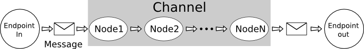

User guide
==========

One image is better than 100 words:




Channels
--------

Channels are chains of processing, the nodes, which use or
transform message contents. A channel is specialised for a type
of input and can be linked to an endpoint for incoming messages.

A channel receives a message, processes it and returns the response.

Channels are the main components of pypeman.
When you want to process a message, you first create a channel then add nodes to
process the message.

.. autoclass:: pypeman.channels.BaseChannel
    :members:
    :noindex:


.. ttt
    * Duplicate path with `.fork()`
    * Make conditionnal alternative path with `.when(condition)`
    * Make conditionnal case paths with `.case(condition1, condition2, ...)` returns one channel for each
      arg condition.

..  autoclass:: pypeman.contrib.time.CronChannel
    :members:
    :noindex:

..  autoclass:: pypeman.contrib.http.HttpChannel
    :members:
    :noindex:

..  autoclass:: pypeman.channels.FileWatcherChannel
    :members:
    :noindex:

..  autoclass:: pypeman.contrib.ftp.FTPWatcherChannel
    :members:
    :noindex:

..  autoclass:: pypeman.contrib.hl7.MLLPChannel
    :members:
    :noindex:


Nodes
-----

A node is a processing unit in a channel.
To create a node, inherit form `pypeman.nodes.BaseNode` and
override `process(msg)` method.

You can use persistence storage to save data between two pypeman
executions sush last time a specific channel ran by using the two
following methods: :func:`save_data <pypeman.nodes.BaseNode.save_data>` and
:func:`restore_data<pypeman.nodes.BaseNode.restore_data>`

Specific nodes
``````````````
Base for all node. You must inherit from this class if you want to create
a new node for your project.

..  autoclass:: pypeman.nodes.BaseNode
    :members:
    :noindex:

Thread node allow you to create node that execute is process method in another
thread to avoid blocking nodes.

..  autoclass:: pypeman.nodes.ThreadNode
    :members:
    :noindex:

Other nodes
```````````

See :mod:`pypeman.nodes` and :mod:`pypeman.contrib`.

Messages
--------

Message contains the core information processed by nodes and carried by channel.
The message payload may be: Json, Xml, Soap, Hl7, text, Python object...

Useful attributes:

* payload: the message contents.
* meta: message metadata, should be used to add extra information about the payload.
* context: previous messages can be saved in the context dict for further access.

..  autoclass:: pypeman.message.Message
    :members:
    :noindex:

Endpoints
---------

Endpoints are server instances used by channel to get messages from net protocols like HTTP, Soap or HL7, ....
They listen to a specific port for a specific protocol.

..  autoclass:: pypeman.contrib.http.HTTPEndpoint
    :members:
    :noindex:

..  autoclass:: pypeman.contrib.hl7.MLLPEndpoint
    :members:
    :noindex:

Events
------

Channels fire events which a plugin, or the project itself, can subscribe to.
:obj:`pypeman.events.msg_processing_start` and
:obj:`pypeman.events.msg_processing_end` are fired by every channel around the
processing of a message: this is how extra information can be added to all the
messages without changing the channels themselves.

::

    from pypeman import events
    from pypeman.plugins.base import BasePlugin, TaskPluginMixin


    class TagPlugin(BasePlugin, TaskPluginMixin):
        """Tag every message with the name of the channel handling it."""

        async def task_start(self):
            events.msg_processing_start.add_handler(self.on_msg)

        async def task_stop(self):
            events.msg_processing_start.remove_handler(self.on_msg)

        async def on_msg(self, channel, msg):
            msg.meta["entry_channel"] = channel.name

Handlers may be sync or async and are awaited in the message path, so they must
be quick; an handler raising is logged and does not break the processing.
:class:`pypeman.plugins.msgmetaextender.MsgMetaExtenderPlugin` is a working
example, tagging every message store entry with processing facts: the time the
channel took (``process_time``), the byte size and type of the input and output
payloads (``input_size``/``input_type``/``output_size``/``output_type``), the
``content_type`` and the total size of the saved contexts (``ctx_size``, counting
only the contexts present at channel entry when the processing raised or ended on
a yielding node). It is enabled by default; deactivate through
``settings.DISABLED_PLUGINS``.

See :mod:`pypeman.events` for the list of events and their arguments.

Health and metrics
------------------

Two default plugins expose the state of a running pypeman on the shared
plugins web app (``settings.WEBAPP_PLUGINS_CONFIG``, ``localhost:8091`` by
default); both can be deactivated through ``settings.DISABLED_PLUGINS``.

:class:`pypeman.plugins.health.HealthPlugin` answers ``GET /health`` (prefix
configurable via ``HEALTH_CONFIG["url"]``) with a JSON document: overall
``ok``/``degraded`` status (degraded when a channel is paused or errored within
``HEALTH_CONFIG["degraded_error_window"]`` seconds), pypeman version, process
info (pid, uptime, memory), event-loop health, and per-channel status,
in-flight processing time, retry state, store count and last message/error
times. ``GET /health/channels/<name>`` answers for a single channel.

:class:`pypeman.plugins.metrics.MetricsPlugin` answers
``GET /metrics/channels[/<name>]`` (prefix configurable via
``METRICS_CONFIG["url"]``) with per-channel JSON stats: message and error
counts and mean/min/max processing time since start; with ``start_dt`` /
``end_dt`` ISO query parameters, it also aggregates the channel's message
store metas over that time range (counts by state, stats of the
``process_time`` meta written by MsgMetaExtenderPlugin — for a retry-deferred
message that meta holds the duration up to the deferral, as replays are injected
without firing the message events — and throughput). ``GET /metrics``
serves the live counters and gauges in the Prometheus text format, ready to
scrape; ``GET /metrics/live`` serves the exact same snapshot as JSON.

Both read live counters from a shared event-fed collector
(:mod:`pypeman.plugins.stats`): those figures start from zero at each
``pypeman start`` and do not include retry replays (retry data comes from the
channels' retry stores; time-range stats come from the message stores and
survive restarts).

Only failures are counted as errors: messages deliberately dropped (a ``Drop``
node, a filtering fork) are counted apart as ``dropped`` and never degrade
``/health``, and messages refused by a stopping channel are not counted at all.
Traffic entering a :class:`pypeman.channels.MergeChannel` through one of its
input channels is reported under the merge channel.

Message Stores
--------------

A Message store is really useful to keep a copy of all messages sent to a channel.
It's like a log but with complete message data and metadata. This way you can trace all
processing or replay a specific message (Not implemented yet). Each channel can have its message store.

You don't use message stores directly but a MessageStoreFactory instance to allow reuse of a configuration.

Generic classes
```````````````

..  autoclass:: pypeman.msgstore.MessageStoreFactory
    :members:
    :noindex:

..  autoclass:: pypeman.msgstore.MessageStore
    :members:
    :noindex:

Message store factories
```````````````````````

..  autoclass:: pypeman.msgstore.NullMessageStoreFactory
    :members:
    :noindex:

..  autoclass:: pypeman.msgstore.FakeMessageStoreFactory
    :members:
    :noindex:

..  autoclass:: pypeman.msgstore.MemoryMessageStoreFactory
    :members:
    :noindex:

..  autoclass:: pypeman.msgstore.FileMessageStoreFactory
    :members:
    :noindex:
